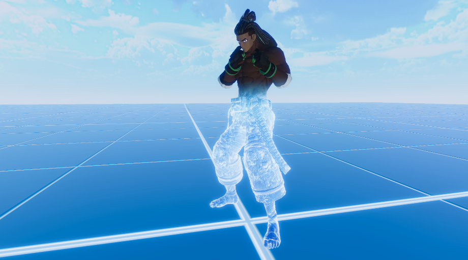
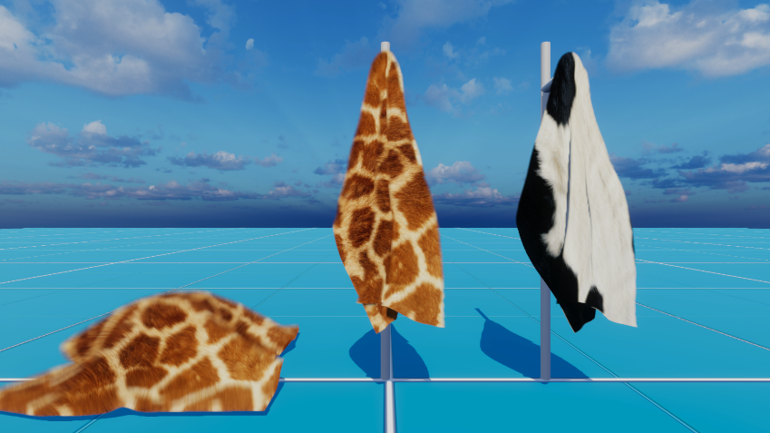
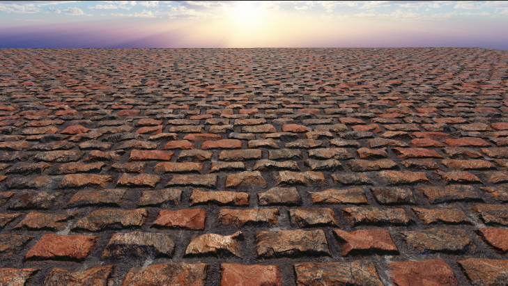
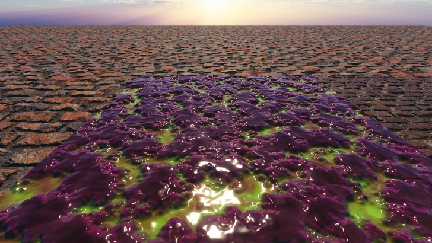

# LearnURP

> Unity Version: **Unity2021.3.11f1**

记录一下在URP中实现的一些效果Demo。

注意需要修改一下URP的源码，暴露部分接口，把 `private`或者 `internal` 改为 `public`。

|            Class            |            Function or Property            |
| :--------------------------: | :----------------------------------------: |
|                              |         GetCameraColorFrontBuffer         |
|                              |              SwapColorBuffer              |
| UniversalRenderPipelineAsset | rendererDisplayList rendererIndexList |
|                              |                                            |

### [Grass(GPU Instance)](https://github.com/csdjk/LearnURP/tree/main/Assets/Scenes/GpuInstance/Grass)

### [Ice](https://github.com/csdjk/LearnURP/tree/main/Assets/Scenes/Ice/)

### [Ice2](https://github.com/csdjk/LearnURP/tree/main/Assets/Scenes/Ice/)

### [RainRipple](https://github.com/csdjk/LearnURP/tree/main/Assets/Scenes/RainRipple/)

### [Rain(天刀方案)](https://github.com/csdjk/LearnURP/tree/main/Assets/Scenes/Rain/)

### [SSR](https://github.com/csdjk/LearnURP/tree/main/Assets/Scenes/SSR/)

### [SSPR](https://github.com/csdjk/LearnURP/tree/main/Assets/Scenes/SSPR/)

### [FastVolumeLight](https://github.com/csdjk/LearnURP/tree/main/Assets/Scenes/VolumeLight/)

后处理实现，适合移动端的体积光。

### [毛发](https://github.com/csdjk/LearnURP/tree/main/Assets/Scenes/Fur/)

### [ParallaxMapping](https://github.com/csdjk/LearnURP/tree/main/Assets/Scenes/ParallaxMapping/)

