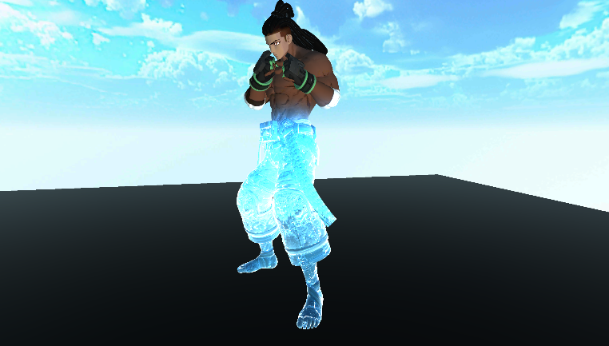
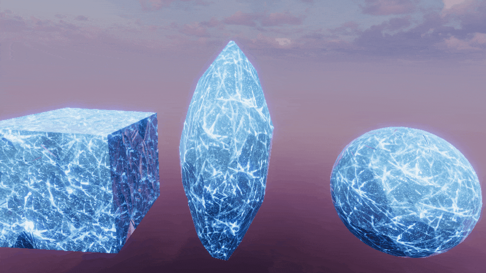
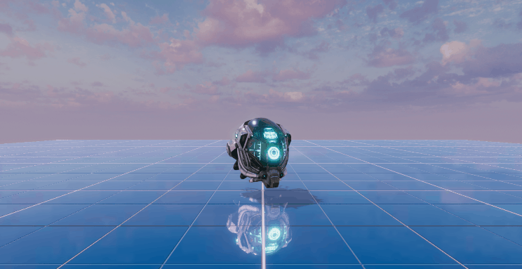
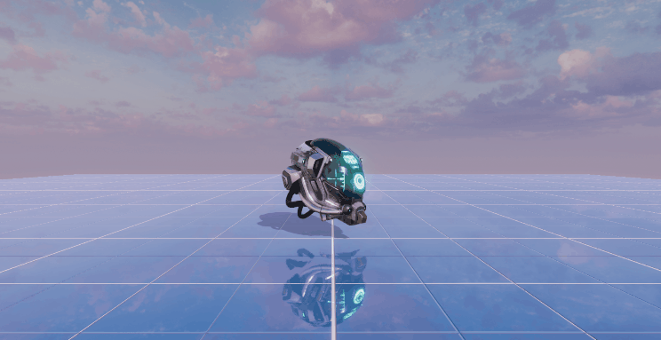

# LearnURP

> Unity Version: **Unity2021.3.11f1**

记录一下在URP中实现的一些效果Demo。

注意需要收到修改一下URP的源码，`GetCameraColorFrontBuffer`和 `SwapColorBuffer`方法的 `internal`改为 `public`。

### [Grass(GPU Instance)](https://github.com/csdjk/LearnURP/tree/main/Assets/Scenes/GpuInstance/Grass)

### [Ice](https://github.com/csdjk/LearnURP/tree/main/Assets/Scenes/Ice/)

### [Ice2](https://github.com/csdjk/LearnURP/tree/main/Assets/Scenes/Ice/)

### [RainRipple](https://github.com/csdjk/LearnURP/tree/main/Assets/Scenes/RainRipple/)

### [Rain](https://github.com/csdjk/LearnURP/tree/main/Assets/Scenes/Rain/)

### [SSR](https://github.com/csdjk/LearnURP/tree/main/Assets/Scenes/SSR/)

### [SSPR](https://github.com/csdjk/LearnURP/tree/main/Assets/Scenes/SSPR/)

